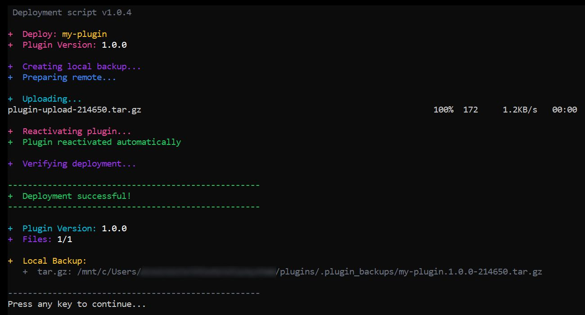
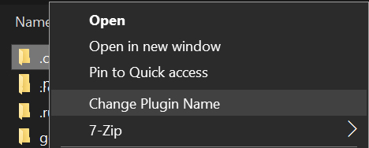
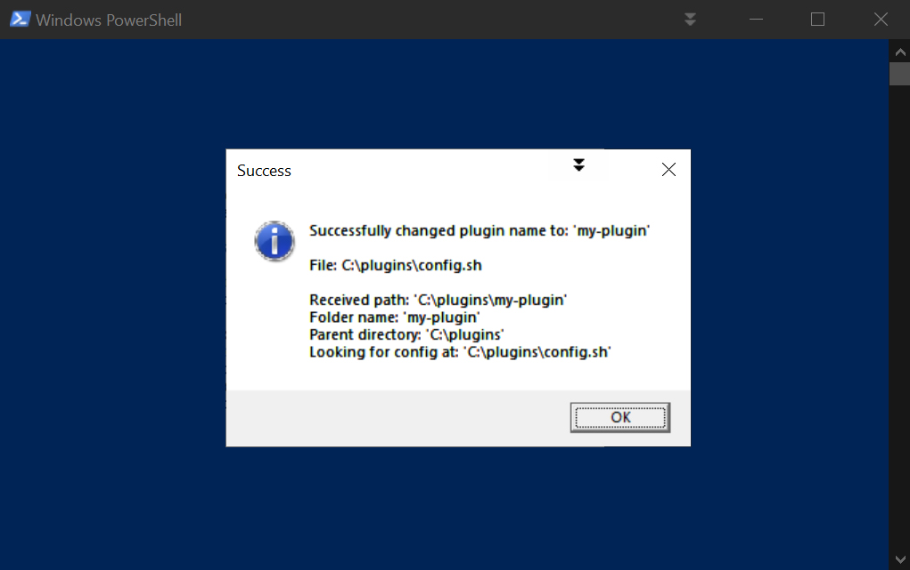

# Fast WordPress Plugin Deployment Script

These show current TYPE setting and switch it automatically.# Fast WordPress Plugin/Theme Deployment Script

A time-saving one-click deployment script for local WordPress plugin AND theme development, eliminates manual file copying and activation; uses wp-cli for automatic plugin reactivation with automatic local and remote backups, fallbacks, and easy setup using a unified config file.


> **Created by:** [lso2](https://github.com/lso2)  
> **Repository:** [wp-fast-remote-deploy](https://github.com/lso2/wp-fast-remote-deploy)


## Summary

This automates several things to save time:
- **Unified Plugin/Theme Support** - Works with both WordPress plugins and themes using a single config
- **Quick Type Switching** - Batch files to instantly switch between plugin and theme modes
- **Right-Click Integration** - Context menu to instantly update folder names
- Backs up the local folder to a .tar.gz
- Backs up the remote folder to a .tar.gz
- Renames remote folder by appending the version number for quick reverting during testing
- Copies the folder quickly from local to remote to the WP directory using a temporary .tar.gz and unpacking remotely
- For plugins: Deactivates and reactivates the plugin using WP-CLI to help re-initialize it
- For themes: Deploys and notifies for manual activation (themes can't be auto-activated safely)
- Gives a summary of what was done

## Quick Usage Guide

- Two files are used: a .bat in the root, and a .sh file in the .run folder.
- Download the repo and drop it directly into your root, so that the .bat file and config file are in the same folder as your plugin folder.
- Configure the config.sh file by adding your real paths and server details.
- In the config file:
	- **Set TYPE** to "plugin" or "theme" depending on what you're deploying
	- Include the folder name like your-plugin-folder-name or your-theme-folder-name in FOLDER_NAME
	- Update the local and remote backup paths
	- Set up your ssh connection
	- Optionally, you can also customize many things, or leave it as is. Remote tar.gz is disabled by default for speed.
- Run the script by double-clicking the .bat file. It will open a CMD window which will show you the progress and details.

#### Bonus:
- Add the right-click menu by double-clicking `/_scripts/_right-click-menu/install-folder-name-changer-menu-item.bat` for quick switching of plugin/theme folders
- Switch between theme/plugin mode either by editing config or double-clicking on `/scripts/switch-to-plugin-type.bat`

## Version Management

### Automatic Version Incrementer

The script includes `update-version.bat` for automatic version number incrementing.

- **Silent operation** - Double-click to increment version numbers automatically
- **Smart targeting** - For plugins: updates `folder-name/folder-name.php`; For themes: updates `style.css`  
- **Configurable backups** - Set `VERSION_BACKUP="true"` in config.sh to create .backup files
- **Visual feedback** - Shows old and new version numbers when updating
- **Auto-close control** - Configure whether window closes automatically after update

**Usage:** Double-click `update-version.bat` - increments patch version (4.3.4 → 4.3.5)

**Config settings:**
```bash
VERSION_BACKUP="true"        # Create backup files before version increment
VERSION_AUTO_CLOSE="false"   # Keep window open to see version changes
```

**Output example:**
```
Plugin header version: 4.3.4 -> 4.3.5
Plugin define version: 4.3.4 -> 4.3.5

Version update completed.
Press any key to continue...
```

## New in Version 2.0.1 - Enhanced Configuration & Organization

🔧 **Configuration Improvements**: Enhanced config file organization and path handling

### Key Improvements:
- **Reorganized Config File** - Clear sections: Required Config, One-Time Setup, Optional Settings
- **Drive Letter Variable** - Configurable drive letter instead of hardcoded "C"
- **Customizable WordPress Folders** - Support for renamed wp-content, plugins, themes folders
- **Flexible Backup Naming** - Configurable prefix and suffix for backup folders
- **Improved Path Logic** - Cleaner LOCAL_PATH handling without hardcoded paths
- **Updated Tools** - Type switcher and right-click menu moved to root with updated paths
- **Generic Script Name** - deploy-plugin-wsl.sh can be renamed to deploy-wsl.sh (works for both types)

## 📸 Screenshot



## 🚀 Features

- ⚡ **Fast Deployment** - SSH multiplexing and parallel operations
- 🔄 **Automatic Plugin Management** - Deactivates/reactivates plugins via WP-CLI
- 💾 **Dual Backup System** - Creates both folder and tar.gz backups locally
- 🗂️ **Version-based Organization** - Automatically extracts version numbers and organizes backups
- 🌐 **Remote Backup Management** - Renames existing remote plugins with version timestamps
- 🎨 **Beautiful Console Output** - Color-coded progress with clean formatting
- 🔧 **WSL Integration** - Windows batch script that calls WSL bash script

## Speed Optimizations

- **SSH Connection Multiplexing** - Reuses connections instead of opening new ones
- **Parallel Local Operations** - Folder backup, tar.gz creation, and upload preparation run simultaneously
- **Combined Remote Operations** - Multiple server commands executed in single SSH sessions
- **Reduced Timeouts** - Optimized connection timeouts for faster failures

## Requirements

- Windows with WSL (Windows Subsystem for Linux)
- SSH access to your WordPress server
- WP-CLI installed on the server (optional but recommended)
- WordPress plugin with version number in main PHP file
- SSH key authentication configured (see setup guide below)
- **pigz** for faster compression (optional, auto-falls back to gzip)

## SSH Key Setup Guide

### Step 1: Generate SSH Key with PuTTYgen

1. **Download and open PuTTYgen** (comes with PuTTY or download separately)
2. **Generate key pair**:
   - Select "RSA" key type
   - Set key size to 2048 or 4096 bits
   - Click "Generate"
   - Move mouse randomly in the blank area to generate randomness
3. **Set key passphrase** (optional but recommended):
   - Enter passphrase in "Key passphrase" field
   - Confirm passphrase
4. **Save the private key**:
   - Click "Save private key"
   - Save as `your-key-name.ppk` (PuTTY format)
5. **Copy the public key**:
   - Select all text in the "Public key for pasting into OpenSSH authorized_keys file" box
   - Copy to clipboard (Ctrl+C)

### Step 2: Convert PuTTY Key to OpenSSH Format

**Option A: Using PuTTYgen**
1. In PuTTYgen, go to **Conversions** → **Export OpenSSH key**
2. Save as `id_rsa` (no extension) in your WSL home directory:
   ```bash
   # From Windows, save to:
   \\wsl$\Ubuntu\home\yourusername\.ssh\id_rsa
   ```

**Option B: Using WSL command line**
```bash
# Install putty-tools in WSL
sudo apt update
sudo apt install putty-tools

# Convert the .ppk file to OpenSSH format
puttygen /mnt/c/path/to/your-key.ppk -O private-openssh -o ~/.ssh/id_rsa

# Set proper permissions
chmod 600 ~/.ssh/id_rsa
```

### Step 3: Add Public Key to Server

**Method 1: Using ssh-copy-id (recommended)**
```bash
# Copy public key to server
ssh-copy-id -i ~/.ssh/id_rsa.pub username@your-server-ip -p 22
```

**Method 2: Manual setup**
1. **Create the public key file locally**:
   ```bash
   # Extract public key from private key
   ssh-keygen -y -f ~/.ssh/id_rsa > ~/.ssh/id_rsa.pub
   ```

2. **Add to server manually**:
   ```bash
   # Connect to server with password
   ssh username@your-server-ip -p 22
   
   # Create .ssh directory if it doesn't exist
   mkdir -p ~/.ssh
   chmod 700 ~/.ssh
   
   # Create/edit authorized_keys file
   nano ~/.ssh/authorized_keys
   
   # Paste your public key (from PuTTYgen clipboard) into this file
   # Save and exit (Ctrl+X, Y, Enter in nano)
   
   # Set proper permissions
   chmod 600 ~/.ssh/authorized_keys
   ```

### Step 4: Test SSH Connection

```bash
# Test connection from WSL
ssh -i ~/.ssh/id_rsa username@your-server-ip -p 22

# If successful, you should connect without password prompt
# (unless you set a passphrase on your key)
```

### Step 5: Configure SSH for Convenience (Optional)

Create SSH config file for easier connections:
```bash
# Edit SSH config
nano ~/.ssh/config

# Add your server configuration:
Host myserver
    HostName your-server-ip
    Port 22
    User username
    IdentityFile ~/.ssh/id_rsa
    IdentitiesOnly yes

# Set permissions
chmod 600 ~/.ssh/config
```

Now you can connect with just:
```bash
ssh myserver
```

### Installing pigz (Optional - Recommended for Speed)

pigz is a parallel implementation of gzip that provides **2-4x faster compression** on multi-core systems. The script automatically detects and uses pigz if available, otherwise falls back to standard gzip.

**Ubuntu/Debian (WSL):**
```bash
sudo apt update && sudo apt install pigz
```

**CentOS/RHEL/Amazon Linux (WSL):**
```bash
sudo yum install pigz
# or on newer versions:
sudo dnf install pigz
```

**Arch Linux (WSL):**
```bash
sudo pacman -S pigz
```

**openSUSE (WSL):**
```bash
sudo zypper install pigz
```

**Remote Server Installation:**
Install pigz on your remote server using the same commands for your server's Linux distribution.

**Configuration:**
```bash
# In config.sh - for pigz (default, faster)
COMPRESSION_TOOL="pigz"

# In config.sh - for standard gzip
COMPRESSION_TOOL="gzip"
```

**Performance Comparison:**
- **gzip**: Single-threaded, slower but universally available
- **pigz**: Multi-threaded, 2-4x faster on multi-core systems
- **Auto-fallback**: Script uses pigz if available, gzip otherwise (no user intervention needed)

### Troubleshooting SSH Issues

**Permission denied (publickey)**
```bash
# Check key permissions
ls -la ~/.ssh/
# id_rsa should be 600, id_rsa.pub should be 644

# Fix permissions if needed
chmod 600 ~/.ssh/id_rsa
chmod 644 ~/.ssh/id_rsa.pub
chmod 700 ~/.ssh
```

**Connection refused**
- Verify server IP and port
- Check if SSH service is running on server
- Ensure firewall allows SSH connections

**Key not being used**
```bash
# Test with verbose output
ssh -v -i ~/.ssh/id_rsa username@your-server-ip -p 22

# Check if key is loaded
ssh-add -l

# Add key to agent if needed
ssh-add ~/.ssh/id_rsa
```

## Installation

1. Clone this repository to your plugin development directory
2. Edit the configuration variables in `deploy-wsl.sh`
3. Set up SSH key authentication to your server
4. Make the script executable: `chmod +x deploy-wsl.sh`

## Right-Click Menu Integration

For even faster workflow, you can install a Windows right-click context menu that automatically updates the `FOLDER_NAME` in your config.sh file based on the folder you right-click on.

### Installation
1. **Run as Administrator**: Right-click `_right-click-menu/install-folder-name-changer-menu-item.bat` and select "Run as administrator"
2. **Confirm installation**: You should see "Installation complete!" message

### Usage
1. **Right-click any plugin/theme folder** in your development directory
2. **Select "Change Folder Name"** from the context menu
3. **Automatic update**: The script will find your `config.sh` file and update `FOLDER_NAME="..."` to match the folder name you clicked

### Example Workflow
```
Your Directory Structure:
├── my-awesome-plugin/     ← Right-click this folder
├── another-theme/
├── config.sh              ← FOLDER_NAME gets updated automatically
└── deploy.bat
```

When you right-click on `my-awesome-plugin` and select "Change Folder Name", your config.sh will be updated to:
```bash
FOLDER_NAME="my-awesome-plugin"
```

### Quick Plugin/Theme Switch Right-Click Integration

```cmd
# Install the right-click menu for quick folder switch
_scripts\_right-click-menu\install-folder-name-changer-menu-item.bat

# Uninstall the right-click menu
_scripts\_right-click-menu\install-folder-name-changer-menu-item.bat
```

Right-click any folder in the same directory as the deploy and it will rename the deploy to:

```cmd
DEPLOY__folder-name__type.bat
```

Where "folder-name" is the name of the plugin or theme folder, and type is either "plugin" or "theme", so you can easily see what you are deploying.

## 📸 Screenshots






### Quick Type Switching

Use the batch files in `_scripts/` folder:

```cmd
# Switch to theme mode
_scripts\switch-to-theme-type.bat

# Switch to plugin mode  
_scripts\switch-to-plugin-type.bat
```

These switch current TYPE setting automatically to switch between theme and plugin mode.


### Uninstallation
- **Run as Administrator**: Right-click `_right-click-menu/uninstall-folder-name-changer-menu-item.bat` and select "Run as administrator"

### Requirements
- Windows 10 or later
- Administrator privileges for installation/uninstallation
- PowerShell execution policy allows script execution (handled automatically)

## Configuration

Edit the `config.sh` file in the root directory with your settings:

```bash
# Type Configuration - CHOOSE YOUR DEPLOYMENT TYPE
TYPE="plugin"  # Set to "plugin" or "theme"

# Folder Configuration
FOLDER_NAME="your-plugin-name"  # Change this to switch plugins/themes instantly

# Legacy compatibility (automatically set)
PLUGIN_NAME="$FOLDER_NAME"  # Backwards compatibility

# Base Paths
LOCAL_BASE="/mnt/c/path/to/your/plugins"  # For plugins
# LOCAL_BASE="/mnt/c/path/to/your/themes"   # For themes

# SSH Configuration  
SSH_HOST="your-server-ip"
SSH_PORT="22"
SSH_USER="username"
SSH_KEY="~/.ssh/id_rsa"
REMOTE_BASE="/path/to/wordpress/root"

# Auto-generated paths (based on TYPE)
# Plugin mode: uses wp-content/plugins, .plugin_backups, looks for version in FOLDER_NAME.php
# Theme mode: uses wp-content/themes, .theme_backups, looks for version in style.css

# Performance Options (all default to false = enabled)
SKIP_WP_CLI=false                    # Skip WP-CLI operations
SKIP_REMOTE_TAR_BACKUP=false         # Skip creating remote tar.gz backup
SKIP_REMOTE_FOLDER_RENAME=false      # Skip renaming remote folder backup
SKIP_FILE_COUNT_VERIFICATION=true    # Skip slow file count comparison

# Compression Settings
COMPRESSION_TOOL="pigz"              # pigz (parallel/faster) or gzip (standard)
COMPRESSION_LEVEL=1                  # 1=fastest, 9=best compression
```

### Version Detection

**For Plugins** - Looks for version in main plugin file (FOLDER_NAME.php):
```php
/*
Plugin Name: My Plugin
Version: 1.2.3
*/
```

**For Themes** - Looks for version in style.css:
```css
/*
Theme Name: My Theme
Version: 1.2.3
*/
```

## Performance Optimization

### Speed vs Safety Modes

**Default Mode (Balanced)**
- All backups enabled
- Fast compression (level 1)
- File count verification skipped
- Typical time: 8-12 seconds

**Ultra-Fast Mode (Maximum Speed)**
```bash
SKIP_WP_CLI=true
SKIP_REMOTE_TAR_BACKUP=true
SKIP_REMOTE_FOLDER_RENAME=true
COMPRESSION_LEVEL=1
```
- Only essential operations
- Typical time: 3-5 seconds
- Use for rapid development iterations

**Safe Mode (Maximum Backups)**
```bash
SKIP_WP_CLI=false
SKIP_REMOTE_TAR_BACKUP=false
SKIP_REMOTE_FOLDER_RENAME=false
SKIP_FILE_COUNT_VERIFICATION=false
COMPRESSION_LEVEL=6
```
- All backups and verification enabled
- Better compression
- Typical time: 15-20 seconds
- Use for production deployments

## Usage

### Windows (Recommended)
Double-click `deploy.bat` or run from command line:
```cmd
deploy.bat
```

### WSL/Linux Direct
```bash
./deploy-wsl.sh
```

## How It Works

1. **Version Detection** - Automatically extracts version from plugin's main PHP file OR theme's style.css
2. **Local Backups** - Creates timestamped folder and tar.gz backups
3. **Remote Preparation** - Connects via SSH, handles deactivation based on type, renames existing installation
4. **Fast Upload** - Uses tar.gz compression for quick file transfer
5. **Extraction** - Extracts files directly on server to correct directory (plugins or themes)
6. **Activation** - For plugins: automatically reactivates via WP-CLI; For themes: deploys ready for manual activation
7. **Verification** - Confirms deployment success with appropriate file check

## Version Number Detection

The script automatically detects version numbers from these formats:

**For Plugins** (in main plugin PHP file):
```php
// WordPress standard
Version: 1.2.3

// PHPDoc format
@version 1.2.3

// PHP constant
define('PLUGIN_VERSION', '1.2.3');
```

**For Themes** (in style.css):
```css
/*
Theme Name: Twenty Twenty-Four
Version: 1.2.3
Author: WordPress Team
*/
```

## Backup Organization

### Local Backups
```
# Plugin backups
.plugin_backups/
└── backups_plugin-name/
    ├── plugin-name.1.0.0-143022.tar.gz
    ├── plugin-name.1.0.1-151205.tar.gz
    └── plugin-name.1.0.2-162845.tar.gz

# Theme backups    
.theme_backups/
└── backups_theme-name/
    ├── theme-name.2.1.0-143022.tar.gz
    ├── theme-name.2.1.1-151205.tar.gz
    └── theme-name.2.1.2-162845.tar.gz
```

### Remote Backups
```
wp-content/
├── plugins/
│   ├── plugin-name/           # Current version
│   ├── plugin-name.1.0.0/     # Previous version backup
│   └── plugin-name.1.0.1-143022/  # Duplicate version with timestamp
├── themes/
│   ├── theme-name/            # Current version
│   ├── theme-name.2.1.0/      # Previous version backup
│   └── theme-name.2.1.1-143022/   # Duplicate version with timestamp
└── .backups/
    ├── backups_plugin-name/
    │   ├── plugin-name.1.0.0-143022.tar.gz
    │   └── plugin-name.1.0.1-151205.tar.gz
    └── backups_theme-name/
        ├── theme-name.2.1.0-143022.tar.gz
        └── theme-name.2.1.1-151205.tar.gz
```

## Performance

Typical deployment times:
- **Original manual process**: ~2-3 minutes
- **Fast deployment script**: ~15-20 seconds  

Speed improvements come from:
- Script automates manual repetitive operations 
- SSH connection reuse (saves ~5 seconds)
- Parallel local operations (saves ~3 seconds)
- Combined remote commands (saves ~4 seconds)
- Optimized timeouts (saves ~2 seconds)

## Troubleshooting

### SSH Connection Issues
- Verify SSH key authentication works: `ssh -i ~/.ssh/id_rsa user@host`
- Check SSH port and host configuration
- Ensure SSH key has proper permissions: `chmod 600 ~/.ssh/id_rsa`

### WP-CLI Issues
- Script works without WP-CLI but won't auto-activate plugins
- Install WP-CLI on server for full functionality
- Verify WP-CLI works: `wp --version`

### Permission Issues
- Ensure web server user can write to plugins directory
- Check file ownership after deployment
- Verify SSH user has proper permissions

### Version Detection Fails
- **For plugins**: Ensure your main plugin file has a version number in supported format
- **For themes**: Ensure your style.css has proper WordPress theme header with Version field
- Check file is named correctly (matches FOLDER_NAME variable)
- Verify file is readable and properly formatted
- For themes, style.css must be in the root of the theme folder

## File Structure

```
project/
├── deploy.bat              # Windows batch script
├── config.sh               # Unified configuration file
├── .run/
│   └── deploy-wsl.sh       # Main deployment script (works for both plugins and themes)
├── _type-switcher/         # Quick TYPE switching
│   ├── switch-to-theme-type.bat    # Switch to theme mode
│   └── switch-to-plugin-type.bat   # Switch to plugin mode
├── _right-click-menu/      # Right-click menu integration
│   ├── install-folder-name-changer-menu-item.bat    # Install right-click menu
│   └── uninstall-folder-name-changer-menu-item.bat  # Remove right-click menu
└── README.md              # This file
```

## Contributing

1. Fork the repository
2. Create a feature branch
3. Make your changes
4. Test thoroughly with your own plugin
5. Submit a pull request

## Author

**lso2**
- GitHub: [@lso2](https://github.com/lso2)
- Repository: [wp-fast-remote-deploy](https://github.com/lso2/wp-fast-remote-deploy)

## License

MIT License - feel free to use and modify for your projects.

---

**⭐ If this script saved you time, please star the repository!**

## Changelog

### v2.1.2 - Enhanced User Experience & Theme Support
- **👀 Visual Version Feedback** - Now displays old and new version numbers during update process
- **⏸️ Auto-Close Control** - New `VERSION_AUTO_CLOSE="false"` setting to keep window open for review
- **🎨 Fixed Theme Version Detection** - Properly handles CSS theme version formats without quotes
- **🧹 Cleaned File Output** - Resolved unwanted file creation during version updates
- **📊 Improved User Feedback** - Clear output showing which versions were updated and their changes

### v2.1.1 - Core Functionality Fixes  
- **🔧 Fixed Config Parsing** - Resolved FOLDER_NAME extraction issues with inline comments
- **⚡ Improved PowerShell Integration** - More reliable find/replace operations for version numbers
- **🎯 Enhanced Plugin Support** - Fixed both plugin header and define statement version updates
- **🛠️ Stabilized File Processing** - Resolved file reading and replacement consistency issues
- **🐛 Bug Fixes** - Multiple stability improvements for reliable version incrementing

### v2.1.0 - Automatic Version Management
- **📈 Added Version Incrementer** - New `update-version.bat` for automatic version number bumping
- **🎯 Smart File Targeting** - Automatically updates correct file based on TYPE and FOLDER_NAME from config.sh
- **🔇 Silent Operation** - Double-click to increment version with minimal user interaction
- **💾 Configurable Backups** - New `VERSION_BACKUP="true"` setting to control .backup file creation
- **🔢 Patch Version Increment** - Automatically bumps patch version (4.3.4 → 4.3.5)
- **🔄 Plugin/Theme Support** - Works with both plugins (.php) and themes (style.css) seamlessly
- **📝 Version Pattern Detection** - Finds and updates WordPress standard version formats automatically

### v2.0.1 - Enhanced Configuration & Organization
- **📁 Directory Reorganization** - Moved `_type-switcher` and `_right-click-menu` to root directory with `_` prefix
- **🔧 Enhanced Config File** - Better organization with clear Required/One-Time Setup/Optional sections
- **💾 Drive Letter Configuration** - Configurable `DRIVE_LETTER` variable instead of hardcoded "C" drive
- **📂 Custom WordPress Folders** - Support for renamed `wp-content`, `plugins`, `themes` folders via config variables
- **🎯 Flexible Backup Naming** - Configurable `PREFIX` and `LOCAL_BAK_SUFFIX` for backup folder customization
- **🛠️ Updated Right-Click Menu** - Now updates `FOLDER_NAME` instead of deprecated `PLUGIN_NAME` variable
- **⚡ Path Logic Improvements** - Cleaner `LOCAL_PATH` handling without hardcoded paths or leading slashes
- **🔄 Type Switcher Updates** - Fixed paths for root directory placement and updated user guidance
- **📜 Script Naming** - `deploy-plugin-wsl.sh` can be renamed to generic `deploy-wsl.sh` (works for both types)
- **🧹 Code Cleanup** - Better variable organization and dependency order in config file

### v1.6.2
- **Fixed pigz compression issue** - Resolved 0KB tar files when using pigz compression
- **Corrected pigz filename handling** - Fixed double .gz extension issue (file.tar.gz.gz)
- **Improved pigz implementation** - Create uncompressed tar first, then compress with pigz separately
- **Enhanced compression reliability** - Better error handling for pigz vs gzip operations
- **Fixed remote folder rename logic** - Resolved issue where folder rename was skipped when tar backup was disabled

### v1.6.1
- **Improved pigz error handling** - Better fallback mechanisms when pigz encounters issues
- **Enhanced compression debugging** - Added better error reporting for compression operations
- **Fixed tar command syntax** - Resolved pigz parameter passing issues
- **Stability improvements** - More robust compression tool detection and usage

### v1.6.0
- **Added right-click menu integration** - Windows context menu for instant plugin name switching
- **Automatic config.sh updates** - Right-click any plugin folder to update PLUGIN_NAME automatically
- **PowerShell-based solution** - Robust file modification with error handling and user feedback
- **Visual confirmation dialogs** - Success/error messages with detailed debugging information
- **Easy installation/removal** - Administrator batch scripts for clean context menu management
- **Screenshots added** - Visual documentation showing context menu and confirmation dialogs
- **Enhanced workflow** - No more manual config.sh editing when switching between plugins

### v1.5.4
- **Fixed remote folder rename display** - Now shows exact folder name including timestamp when applicable
- **Enhanced backup reporting** - Changed label from "folder:" to "Remote folder renamed to:"
- **Improved folder tracking** - Better detection of whether timestamp was appended to folder name
- **Cleaner output formatting** - More precise and informative backup summary messages

### v1.5.3
- **Implemented plugin-specific backup subfolders** - Actually creates and uses `/backups_plugin-name/` directories
- **Fixed backup directory creation** - Ensures plugin-specific folders are properly created both locally and remotely
- **Updated backup paths** - All backup operations now use the correct subfolder structure
- **Verified backup organization** - Confirmed backups are properly separated by plugin name

### v1.5.2
- **Comprehensive pigz documentation** - Added detailed installation instructions for multiple Linux distributions
- **Enhanced README** - Improved pigz setup guide with performance comparisons
- **Better user guidance** - Clear instructions for both WSL and remote server pigz installation
- **Configuration examples** - Added clear examples of compression tool settings

### v1.5.1
- **Fixed pigz installation logic** - Removed automatic installation attempts that required sudo prompts
- **Silent compression handling** - Script now quietly uses available compression without user intervention
- **Removed fallback messages** - Clean output with no "pigz not available" warnings
- **Enhanced user experience** - No more interruptions or confusing installation messages
- **Documentation improvements** - Added comprehensive pigz installation guide for manual setup

### v1.5.0
- **Plugin-specific backup folders** - Local and remote backups now organized in `/backups_plugin-name/` subfolders
- **Better backup organization** - Each plugin's backups are cleanly separated from others
- **Improved backup paths** - Eliminates backup file conflicts between multiple plugins
- **Enhanced remote folder tracking** - Better display of actual renamed folder paths with timestamps
- **Fixed backup directory structure** - Consistent organization across local and remote backups

### v1.4.0
- **Enhanced pigz integration** - Improved parallel compression with better error handling
- **Automatic compression detection** - Script intelligently selects best available compression method
- **Performance optimizations** - Further speed improvements in backup and upload operations
- **Better compression feedback** - Clear indication of compression method being used
- **Stability improvements** - More robust handling of compression tool availability

### v1.3.0
- **Added pigz support** - Much faster parallel compression (default) with automatic fallback to gzip
- **Configurable compression tool** - Choose between pigz (multi-threaded) or gzip (standard)
- **Significant speed improvement** - pigz can be 2-4x faster than gzip on multi-core systems
- **Automatic detection** - Falls back to gzip gracefully if pigz is not installed
- **Both local and remote** - Uses selected compression tool for all tar operations

### v1.2.1
- **Fixed compression level syntax** - Corrected tar compression level implementation using GZIP environment variable
- **Resolved tar options error** - Fixed "Options not supported" error when using custom compression levels

### v1.2.0
- **Added comprehensive performance options** - New config flags for skipping WP-CLI, remote backups, and folder renaming
- **Configurable compression levels** - Set compression from 1 (fastest) to 9 (best compression)
- **Better temp file naming** - Upload files now use plugin name (e.g., `tr-donate-upload-123456.tar.gz`)
- **Smarter output messages** - Shows appropriate messages when operations are skipped
- **Faster verification** - Optimized file existence check
- **Ultra-fast mode support** - Can skip all backups for maximum deployment speed

### v1.1.0
- **Added optional file count verification** - New `SKIP_FILE_COUNT_VERIFICATION` config option (default: true)
- **Significantly faster deployments** - Skips slow recursive file counting by default
- **Smart verification** - Still verifies main plugin file exists for deployment confirmation
- **Configurable verification** - Set to false if you want detailed file count comparison
- **Performance improvement** - Reduces verification time from 10-15 seconds to <1 second

### v1.0.8
- **Fixed remote version detection** - Now properly extracts version from remote plugin files
- **Enhanced backup naming** - Remote backups use actual remote version instead of new local version
- **Added fallback handling** - Uses "old" as fallback when version detection fails
- **Improved regex pattern** - Better version number detection with case-insensitive matching
- **Fixed quote escaping** - Resolved bash syntax errors in SSH commands

### v1.0.1
- **Fixed backup logic bug** - only creates tar.gz locally, proper folder+tar.gz remotely
- **Added config.sh file** - centralized configuration, no need to edit script files
- **Fixed timestamp bug** - no longer adds timestamp when folder doesn't exist remotely
- **Dynamic script naming** - batch file reads script name from config
- **Enhanced remote backups** - creates both tar.gz and folder backups on server
- **Improved documentation** - added usage summary and configuration guide

### v1.0.0
- Initial release with basic deployment functionality
- SSH multiplexing for speed optimization
- Dual backup system (folder + tar.gz)
- WP-CLI integration for plugin management
- Color-coded console output
- Windows WSL integration