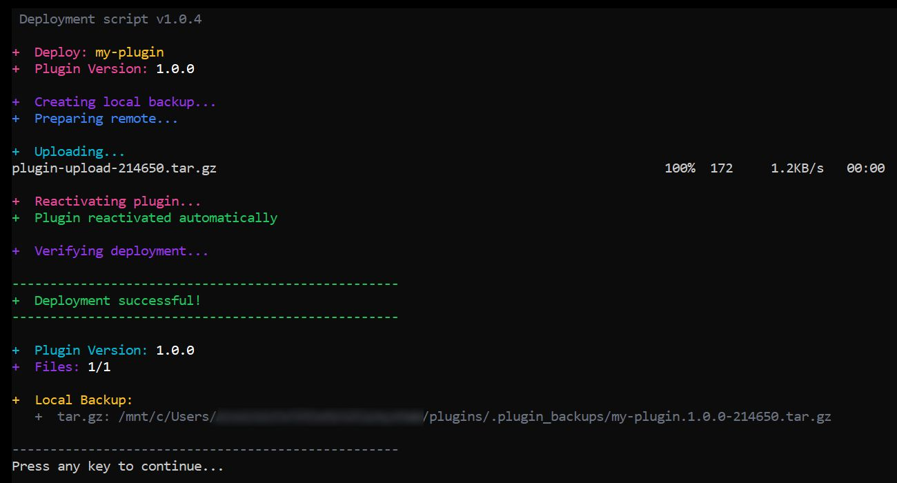

# Ultra Fast WordPress Plugin Deployment Script

> **Created by:** [lso2](https://github.com/lso2)  
> **Repository:** [wp-fast-remote-deploy](https://github.com/lso2/wp-fast-remote-deploy)

A time-saving deployment script for WordPress plugin development that eliminates manual file copying and provides one-click deployment with automatic backups.

## Summary

This automates several things to save time:
- Backs up the local folder to a .tar.gz
- Backs up the remote folder by renaming it by appending the version number  
- Copies the folder locally to the WP plugin directory quickly using a temporary .tar.gz and unpacking remotely
- Deactivates and reactivates the plugin using WP-CLI, to help re-initialize it
- Gives a summary of what was done

## Usage Summary

- Two files are used: a .bat in the root, and a .sh file in the .run folder.
- Download the repo and drop it directly into your root, so that the .bat file is in the same folder as your plugin folders.
- Configure the config.sh file by adding your real paths and server details.
- **Super simple plugin switching:** Just change `PLUGIN_FOLDER="my-plugin"` to `PLUGIN_FOLDER="my-other-plugin"`
- Run the file by double-clicking the .bat file. It will open a CMD window which will show you the progress and details.

## Screenshot



## Features

- ⚡ **Fast Deployment** - SSH multiplexing and parallel operations
- 🔄 **Automatic Plugin Management** - Deactivates/reactivates plugins via WP-CLI
- 💾 **Dual Backup System** - Creates both folder and tar.gz backups locally
- 🗂️ **Version-based Organization** - Automatically extracts version numbers and organizes backups
- 🌐 **Remote Backup Management** - Renames existing remote plugins with version timestamps
- 🎨 **Beautiful Console Output** - Color-coded progress with clean formatting
- 🔧 **WSL Integration** - Windows batch script that calls WSL bash script

## Speed Optimizations

- **SSH Connection Multiplexing** - Reuses connections instead of opening new ones
- **Parallel Local Operations** - Folder backup, tar.gz creation, and upload preparation run simultaneously
- **Combined Remote Operations** - Multiple server commands executed in single SSH sessions
- **Reduced Timeouts** - Optimized connection timeouts for faster failures

## Requirements

- Windows with WSL (Windows Subsystem for Linux)
- SSH access to your WordPress server
- WP-CLI installed on the server (optional but recommended)
- WordPress plugin with version number in main PHP file
- SSH key authentication configured (see setup guide below)

## SSH Key Setup Guide

### Step 1: Generate SSH Key with PuTTYgen

1. **Download and open PuTTYgen** (comes with PuTTY or download separately)
2. **Generate key pair**:
   - Select "RSA" key type
   - Set key size to 2048 or 4096 bits
   - Click "Generate"
   - Move mouse randomly in the blank area to generate randomness
3. **Set key passphrase** (optional but recommended):
   - Enter passphrase in "Key passphrase" field
   - Confirm passphrase
4. **Save the private key**:
   - Click "Save private key"
   - Save as `your-key-name.ppk` (PuTTY format)
5. **Copy the public key**:
   - Select all text in the "Public key for pasting into OpenSSH authorized_keys file" box
   - Copy to clipboard (Ctrl+C)

### Step 2: Convert PuTTY Key to OpenSSH Format

**Option A: Using PuTTYgen**
1. In PuTTYgen, go to **Conversions** → **Export OpenSSH key**
2. Save as `id_rsa` (no extension) in your WSL home directory:
   ```bash
   # From Windows, save to:
   \\wsl$\Ubuntu\home\yourusername\.ssh\id_rsa
   ```

**Option B: Using WSL command line**
```bash
# Install putty-tools in WSL
sudo apt update
sudo apt install putty-tools

# Convert the .ppk file to OpenSSH format
puttygen /mnt/c/path/to/your-key.ppk -O private-openssh -o ~/.ssh/id_rsa

# Set proper permissions
chmod 600 ~/.ssh/id_rsa
```

### Step 3: Add Public Key to Server

**Method 1: Using ssh-copy-id (recommended)**
```bash
# Copy public key to server
ssh-copy-id -i ~/.ssh/id_rsa.pub username@your-server-ip -p 22
```

**Method 2: Manual setup**
1. **Create the public key file locally**:
   ```bash
   # Extract public key from private key
   ssh-keygen -y -f ~/.ssh/id_rsa > ~/.ssh/id_rsa.pub
   ```

2. **Add to server manually**:
   ```bash
   # Connect to server with password
   ssh username@your-server-ip -p 22
   
   # Create .ssh directory if it doesn't exist
   mkdir -p ~/.ssh
   chmod 700 ~/.ssh
   
   # Create/edit authorized_keys file
   nano ~/.ssh/authorized_keys
   
   # Paste your public key (from PuTTYgen clipboard) into this file
   # Save and exit (Ctrl+X, Y, Enter in nano)
   
   # Set proper permissions
   chmod 600 ~/.ssh/authorized_keys
   ```

### Step 4: Test SSH Connection

```bash
# Test connection from WSL
ssh -i ~/.ssh/id_rsa username@your-server-ip -p 22

# If successful, you should connect without password prompt
# (unless you set a passphrase on your key)
```

### Step 5: Configure SSH for Convenience (Optional)

Create SSH config file for easier connections:
```bash
# Edit SSH config
nano ~/.ssh/config

# Add your server configuration:
Host myserver
    HostName your-server-ip
    Port 22
    User username
    IdentityFile ~/.ssh/id_rsa
    IdentitiesOnly yes

# Set permissions
chmod 600 ~/.ssh/config
```

Now you can connect with just:
```bash
ssh myserver
```

### Troubleshooting SSH Issues

**Permission denied (publickey)**
```bash
# Check key permissions
ls -la ~/.ssh/
# id_rsa should be 600, id_rsa.pub should be 644

# Fix permissions if needed
chmod 600 ~/.ssh/id_rsa
chmod 644 ~/.ssh/id_rsa.pub
chmod 700 ~/.ssh
```

**Connection refused**
- Verify server IP and port
- Check if SSH service is running on server
- Ensure firewall allows SSH connections

**Key not being used**
```bash
# Test with verbose output
ssh -v -i ~/.ssh/id_rsa username@your-server-ip -p 22

# Check if key is loaded
ssh-add -l

# Add key to agent if needed
ssh-add ~/.ssh/id_rsa
```

## Installation

1. Clone this repository to your plugin development directory
2. Edit the configuration variables in `deploy-wsl.sh`
3. Set up SSH key authentication to your server
4. Make the script executable: `chmod +x deploy-wsl.sh`

## Configuration

Edit the `config.sh` file in the root directory with your settings:

```bash
# PLUGIN CONFIGURATION - Just change the plugin folder name here!
PLUGIN_FOLDER="your-plugin-folder"  # Change this to switch plugins instantly

# Local Environment
LOCAL_BASE="/mnt/c/path/to/your/plugins"
LOCAL_BACKUP_FOLDER=".plugin_backups"  # Folder name for backups

# Remote Environment  
REMOTE_BASE="/path/to/wordpress/root"
REMOTE_PLUGINS_FOLDER="wp-content/plugins"
REMOTE_BACKUP_FOLDER=".backups"

# SSH Configuration
SSH_HOST="your-server-ip"
SSH_PORT="22"
SSH_USER="username"
SSH_KEY="~/.ssh/id_rsa"
```

### Streamlined Path Management

**No path repetition!** Set base paths once:
- **Local:** `/mnt/c/path/to/your/plugins/`
- **Remote:** `/path/to/wordpress/root/`

**Automatic path building:**
- `LOCAL_PLUGIN_DIR` = `LOCAL_BASE` + `PLUGIN_FOLDER`
- `REMOTE_PLUGINS_DIR` = `REMOTE_BASE` + `wp-content/plugins`
- `BACKUP_DIR` = `LOCAL_BASE` + `.plugin_backups`

**Easy environment switching:** Change `REMOTE_BASE` to switch between staging/production servers!

### Super Simple Plugin Switching

To switch between plugins:
1. Open `config.sh`
2. Change `PLUGIN_FOLDER="my-plugin"` to `PLUGIN_FOLDER="my-other-plugin"`
3. Save and run `deploy.bat`

**No complex definitions needed!** Just use your actual plugin folder names.

## Usage

### Windows (Recommended)
Double-click `deploy.bat` or run from command line:
```cmd
deploy.bat
```

### WSL/Linux Direct
```bash
./deploy-wsl.sh
```

## How It Works

1. **Version Detection** - Automatically extracts version from plugin's main PHP file
2. **Local Backups** - Creates timestamped folder and tar.gz backups
3. **Remote Preparation** - Connects via SSH, deactivates plugin, renames existing installation
4. **Fast Upload** - Uses tar.gz compression for quick file transfer
5. **Extraction** - Extracts files directly on server
6. **Reactivation** - Automatically reactivates the plugin via WP-CLI
7. **Verification** - Confirms deployment success with file count comparison

## Version Number Detection

The script automatically detects version numbers from these formats in your main plugin file:

```php
// WordPress standard
Version: 1.2.3

// PHPDoc format
@version 1.2.3

// PHP constant
define('PLUGIN_VERSION', '1.2.3');
```

## Backup Organization

### Local Backups
```
_plugin_backups/
├── plugin-name.1.0.0.tar.gz
├── plugin-name.1.0.0-143022/
├── plugin-name.1.0.1.tar.gz
├── plugin-name.1.0.1-151205/
```

### Remote Backups
```
wp-content/plugins/
├── plugin-name/           # Current version
├── plugin-name.1.0.0/     # Previous version backup
├── plugin-name.1.0.1-143022/  # Duplicate version with timestamp
```

## Performance

Typical deployment times:
- **Original manual process**: ~2-3 minutes
- **Fast deployment script**: ~15-20 seconds  

Speed improvements come from:
- Script automates manual repetitive operations 
- SSH connection reuse (saves ~5 seconds)
- Parallel local operations (saves ~3 seconds)
- Combined remote commands (saves ~4 seconds)
- Optimized timeouts (saves ~2 seconds)

## Troubleshooting

### SSH Connection Issues
- Verify SSH key authentication works: `ssh -i ~/.ssh/id_rsa user@host`
- Check SSH port and host configuration
- Ensure SSH key has proper permissions: `chmod 600 ~/.ssh/id_rsa`

### WP-CLI Issues
- Script works without WP-CLI but won't auto-activate plugins
- Install WP-CLI on server for full functionality
- Verify WP-CLI works: `wp --version`

### Permission Issues
- Ensure web server user can write to plugins directory
- Check file ownership after deployment
- Verify SSH user has proper permissions

### Version Detection Fails
- Ensure your main plugin file has a version number in supported format
- Check file is named correctly (matches PLUGIN_NAME variable)
- Verify file is readable and properly formatted

## File Structure

```
project/
├── deploy.bat              # Windows batch script
├── config.sh               # Configuration file
├── .run/
│   └── deploy-wsl.sh      # Main deployment script
└── README.md              # This file
```

## Contributing

1. Fork the repository
2. Create a feature branch
3. Make your changes
4. Test thoroughly with your own plugin
5. Submit a pull request

## Author

**lso2**
- GitHub: [@lso2](https://github.com/lso2)
- Repository: [wp-fast-remote-deploy](https://github.com/lso2/wp-fast-remote-deploy)

## License

MIT License - feel free to use and modify for your projects.

---

**⭐ If this script saved you time, please star the repository!**

## Changelog

### v1.0.1
- **Fixed backup logic bug** - only creates tar.gz locally, proper folder+tar.gz remotely
- **Added config.sh file** - centralized configuration, no need to edit script files
- **Fixed timestamp bug** - no longer adds timestamp when folder doesn't exist remotely
- **Dynamic script naming** - batch file reads script name from config
- **Enhanced remote backups** - creates both tar.gz and folder backups on server
- **Improved documentation** - added usage summary and configuration guide

### v1.0.0
- Initial release with basic deployment functionality
- SSH multiplexing for speed optimization
- Dual backup system (folder + tar.gz)
- WP-CLI integration for plugin management
- Color-coded console output
- Windows WSL integration