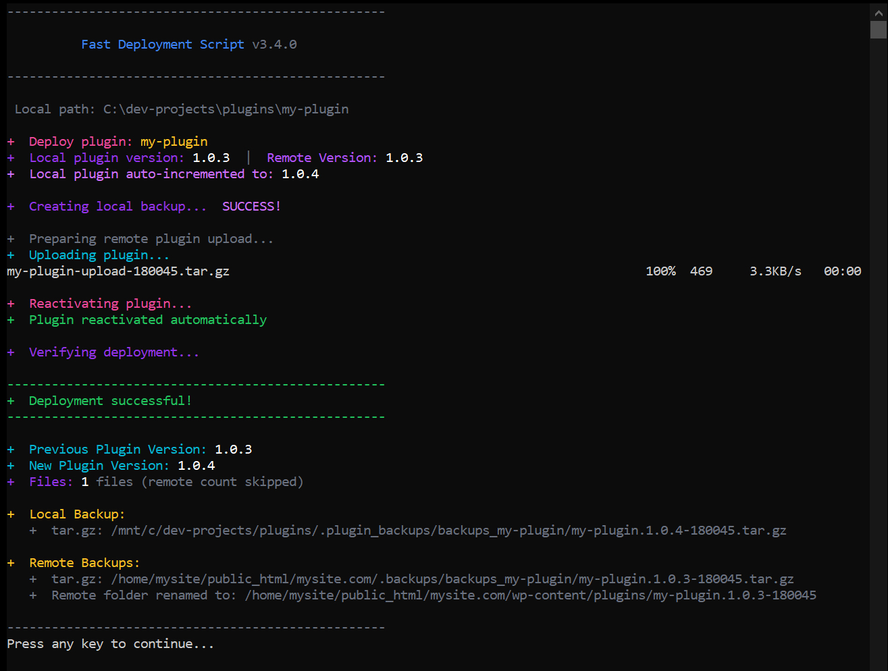
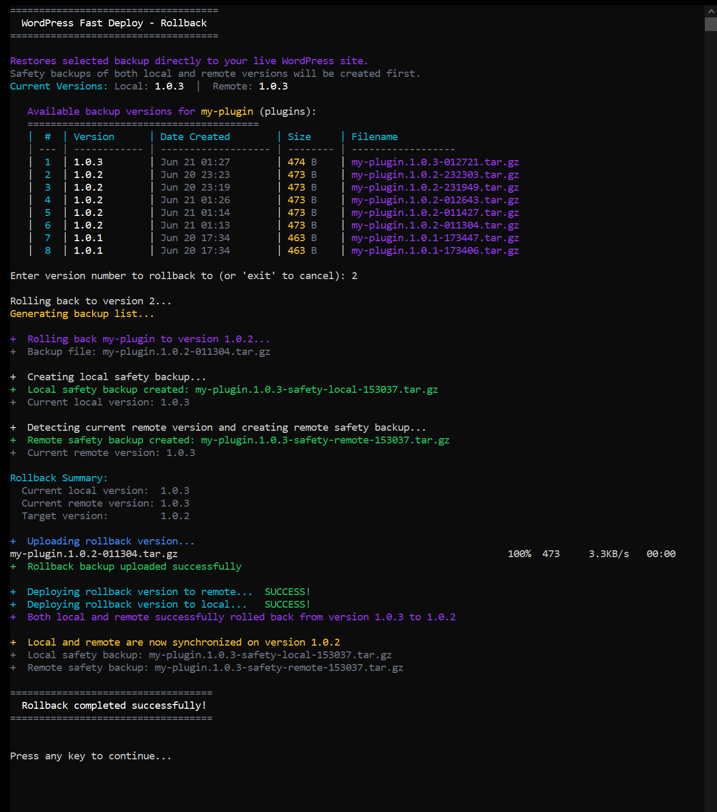

# Fast WordPress Plugin/Theme Deployment Script


> **Created by:** [lso2](https://github.com/lso2)  
> **Repository:** [wp-fast-remote-deploy](https://github.com/lso2/wp-fast-remote-deploy)

A time-saving one-click deployment script for local WordPress plugin AND theme development, eliminates manual file copying and activation; uses wp-cli for automatic plugin reactivation with automatic local and remote backups, fallbacks, and easy setup using a unified config file.

### ⚡ Quick Access

| Feature | Description | Link |
|---------|-------------|------|
| **🚀 Deploy** | One-click deployment script | [Quick Usage Guide](#quick-usage-guide) |
| **🔄 Rollback** | Smart local+remote rollback | [Rollback System](#smart-rollback-system) |
| **📈 Version** | Auto version incrementer | [Version Management](#automatic-version-incrementer) |
| **💾 Database** | Backup/restore database | [Database Backup](#database-backup-system-alpha---in-testing) |
| **🔍 Auto-Detect** | Plugin vs Theme detection | [Auto-Detection](#auto-detection-system) |

## Summary

This automates several things to save time:
- **Unified Plugin/Theme Support** - Works with both WordPress plugins and themes using a single config
- **Auto-Detection System** - Automatically detects plugin vs theme based on WordPress standards
- **Right-Click Integration** - Context menu to instantly switch projects with intelligent type detection
- **Smart Rollback System** - Safely rollback both local and remote files with automatic safety backups
- Backs up the local folder to a .tar.gz
- Backs up the remote folder to a .tar.gz
- Renames remote folder by appending the version number for quick reverting during testing
- Copies the folder quickly from local to remote to the WP directory using a temporary .tar.gz and unpacking remotely
- For plugins: Deactivates and reactivates the plugin using WP-CLI to help re-initialize it
- For themes: Deploys and notifies for manual activation (themes can't be auto-activated safely)
- **Database Backup System** - Automated database backups with manual and auto modes
- Gives a summary of what was done

# 📚 Table of Contents

| Category | Sections |
|----------|----------|
| **🚀 Quick Start** | [Summary](#summary) • [Features](#-features) • [Requirements](#requirements) • [Installation](#installation) • [Quick Usage](#quick-usage-guide) |
| **⚙️ Configuration** | [Main Config](#configuration) • [Version Detection](#version-detection) • [Performance Modes](#performance-optimization) • [SSH Setup](#ssh-key-setup-guide) |
| **🎯 Core Features** | [Auto-Detection](#auto-detection-system) • [Version Manager](#automatic-version-incrementer) • [Smart Rollback](#smart-rollback-system) • [Database Backup](#database-backup-system-alpha---in-testing) |
| **🛠️ Tools** | [One-Click Scripts](#one-click-automation-scripts) • [Right-Click Menu](#auto-detecting-right-click-menu-integration) • [Sample Project](#sample-data-quick-install) |
| **📋 Usage** | [Deploy](#usage-3) • [How It Works](#how-it-works) • [Backup Organization](#backup-organization) • [Rollback Modes](#rollback-modes) |
| **🔧 Troubleshooting** | [Common Issues](#troubleshooting) • [SSH Issues](#troubleshooting-ssh-issues) • [Line Endings](#line-ending-issues) • [Detection Issues](#auto-detection-issues) |
| **📁 Reference** | [File Structure](#file-structure) • [Changelog](#changelog) • [Contributing](#contributing) • [Support](#-support-this-project) |
| **📸 Visuals** | [Deploy Screenshot](#-fast-deploy-script-screenshot) • [Rollback Screenshot](#-rollback-screenshot) • [Sample Data](#-sample-data-screenshot) • [Right-Click Menu](#-right-click-menu-screenshot) |

---

## 📸 Fast Deploy Script Screenshot



## Quick Usage Guide

- The main files you will use are `deploy.bat`, `_scripts/update-version.bat`, and `_scripts/rollback.bat`.
- Download the repo and drop it directly into your root, so that the .bat file and config file are in the same folder as your plugin folder.
- Configure the config.sh file by adding your real paths and server details.
- In the config file:
	- **Auto-detection handles TYPE** - Right-click menu now automatically detects plugin vs theme
	- Include the folder name like your-plugin-folder-name or your-theme-folder-name in FOLDER_NAME
	- Update the local and remote backup paths
	- Set up your ssh connection
	- Optionally, you can also customize many things, or leave it as is. Remote tar.gz is disabled by default for speed.
- Run the script by double-clicking the .bat file. It will open a CMD window which will show you the progress and details.
- **NEW: Automatic Version Increment** - When local and remote versions match, the script automatically increments your local version before deployment!

## Quick Start

- After downloading the github release, double-click on `install-sample-data.bat` in the `/_scripts/` folder to install the whole project structure for themes and plugins in one click!

#### Bonus:
- Add the auto-detecting right-click menu by double-clicking `/_scripts/_right-click-menu/install-auto-detect-folder-switcher.bat` for instant switching with intelligent type detection
- Manual type switchers still available: `/_scripts/_advanced/type switcher/switch-to-plugin-type.bat` and `/_scripts/_advanced/type switcher/switch-to-theme-type.bat` - move to the root of the `_scripts` folder before using so it works.

## Version Management

### Automatic Version Incrementer

The script includes `update-version.bat` for automatic version number incrementing.

- **Silent operation** - Double-click to increment version numbers automatically
- **Smart targeting** - For plugins: updates `folder-name/folder-name.php`; For themes: updates `style.css`  
- **Readme.txt support** - Automatically updates "Stable tag" field in readme.txt when present
- **Configurable backups** - Set `VERSION_BACKUP="true"` in config.sh to create .backup files
- **Visual feedback** - Shows old and new version numbers when updating
- **Auto-close control** - Configure whether window closes automatically after update

**Usage:** Double-click `update-version.bat` - increments patch version (1.0.3 → 1.0.4)

**Config settings:**
```bash
VERSION_BACKUP="true"        # Create backup files before version increment
VERSION_AUTO_CLOSE="false"   # Keep window open to see version changes
```

**Output example:**
```bash
Plugin header version updated: 1.0.3 → 1.0.4
Plugin define version updated: 1.0.3 → 1.0.4
readme.txt Stable tag updated: 1.0.3 → 1.0.4

Version update completed.
Press any key to continue...
```

## Smart Rollback System

### Comprehensive Local + Remote Rollback
- **🔄 Synchronized Rollback** - Rolls back both local and remote files to keep them in sync
- **🛡️ Safety Backups** - Creates safety backups of current versions before rollback
- **🎯 Version Detection** - Separately detects local and remote versions (handles mismatched scenarios)
- **📋 Visual Backup Selection** - Browse available backups with version numbers, dates, and file sizes
- **⚙️ Configurable Behavior** - Choose between full sync or remote-only rollback

## 📸 Rollback Screenshot



### Rollback Modes

**Full Sync Mode (Default - `ROLLBACK_SYNC_LOCAL="true"`):**
1. Creates local safety backup: `my-plugin.1.9-safety-local-123456.tar.gz`
2. Creates remote safety backup: `my-plugin.2.0-safety-remote-123456.tar.gz`  
3. Rolls back both local and remote to selected version
4. Ensures perfect synchronization between environments

**Remote-Only Mode (`ROLLBACK_SYNC_LOCAL="false"`):**
1. Only rolls back remote server
2. Shows warning about local/remote version mismatch
3. Perfect for testing scenarios where you want to keep local changes

### Usage
```bash
# List available backups
_scripts/rollback.bat

# The script will show:
Available backup versions for my-plugin (plugins):
========================================
|  #  | Version      | Date Created        | Size     | Filename
| --- | ------------ | ------------------- | -------- | ------------------
|  1  | 1.2.3        | Jun 20 2025 14:30   | 2.1 MB   | my-plugin.1.2.3-143022.tar.gz
|  2  | 1.2.2        | Jun 19 2025 09:15   | 2.0 MB   | my-plugin.1.2.2-091502.tar.gz

Enter version number to rollback to: 1    # Select by number or version
```

## Sample Data Quick Install

**📦 Instant Project Setup**
The sample data system provides a complete WordPress development environment with one click:

- **Sample Project Structure**: Creates `my-project` folder with proper WordPress plugin/theme structure
- **Pre-configured Scripts**: All deployment scripts already set up and ready to use
- **Test Data Included**: Sample backups for testing the rollback functionality

**Installation:**
- **One-Click Setup**: Run `_scripts\install-sample-data.bat` to install complete project structure
- **Target Location**: Installs to parent directory (two levels up from script location)
- **Automatic Extraction**: Handles tar.gz extraction with proper directory structure

**What's Included:**
- **my-plugin/** - Empty plugin starter with basic structure
- **my-theme/** - Empty theme starter with style.css
- **Deployment Scripts** - Pre-configured deploy.bat, config.sh, and all utilities
- **Sample Backups** - Test files for practicing rollback functionality
- **.plugin_backups/** - Directory with sample plugin backups
- **.theme_backups/** - Directory with sample theme backups

**Usage Example:**
# Run from _scripts folder
```cmd
install-sample-data.bat
```

# Creates this structure in parent directory:
```cmd
my-project/
├── plugins/
│   └── my-plugin/         # Empty plugin starter
├── themes/
│   └── my-theme/          # Empty theme starter
├── deploy.bat             # Ready to use
├── config.sh              # Just add SSH details
├── update-version.bat     # Version management
└── _scripts/              # All utilities included
```

## 📸 Sample Data Screenshot


## Auto-Detection System

**🔍 Intelligent Type Detection**
The right-click menu now automatically detects whether you're working on a plugin or theme using WordPress standards:

- **Theme Detection**: Looks for `Theme Name:` header in `style.css` (WordPress requirement)
- **Plugin Detection**: Default when no `Theme Name:` found (foolproof fallback)

**Benefits:**
- **No Manual Switching** - Right-click any folder and it auto-configures correctly  
- **Edge Case Proof** - Handles plugins that have `style.css` files correctly
- **Zero Configuration** - No more manually setting TYPE in config
- **Accurate** - Based on WordPress requirements, not file existence


## 📸 Right-Click Menu Screenshot


## Database Backup System (Alpha - In Testing)

### Automated Database Backups
- **🔧 Three Operation Modes** - Off, manual tools only, or automatic with deployment
- **📊 Smart Credential Detection** - Reads from wp-config.php automatically or uses manual overrides
- **🛡️ Connection-Only Users** - Works with backup users that have dump privileges but no login access
- **💾 Multiple Storage Options** - Custom backup locations or WordPress directory storage

### Database Modes

**Off Mode (`DB_BACKUP_MODE="off"`):**
- No database operations
- Pure deployment focus

**Manual Mode (`DB_BACKUP_MODE="manual"`):**
- Provides `_scripts/db-backup.bat` for on-demand backups
- `_scripts/db-restore.bat` for restoring from backups
- No automatic backup during deployment

**Auto Mode (`DB_BACKUP_MODE="auto"`):**
- Automatically creates database backup before each deployment
- Provides all manual tools plus integration

### Configuration
```bash
# Database backup modes
DB_BACKUP_MODE="manual"          # "off", "manual", or "auto"

# Expert manual override (optional)
DB_OVERRIDE_ENABLED="false"      # Use manual database settings instead of wp-config.php
DB_NAME="your_database"          # Manual database name
DB_USER="your_db_user"          # Manual database user  
DB_PASS="your_db_password"      # Manual database password
DB_HOST="your_db_host"          # Manual database host (default: localhost)
DB_PORT="your_db_port"          # Manual database port (default: 3306)

# Custom backup location (optional)
DB_PATH_ENABLED="false"         # Enable custom backup directory
DB_PATH="/custom/backup/path"   # Custom backup location
```

## New in Version 3.3.5 - One-click Sample Data Install Script
- **📦 One-Click Sample Project** - New `install-sample-data.bat` installs complete WordPress project structure instantly
- **🚀 Zero-to-Deploy Setup** - Pre-configured project with plugin, theme, and deployment scripts ready to use
- **🎯 Perfect for Beginners** - Start developing immediately without manual folder creation or configuration
- **🧪 Testing Environment** - Includes sample backups for testing rollback functionality

## New in Version 3.3.4 - Smart Rollback System, Auto-Detection, & Enhanced Reliability
- **🛡️ Smart Rollback System** - Synchronized local+remote rollback with separate safety backups and independent version detection
- **🔍 Auto-Detection System** - Right-click menu now uses WordPress `Theme Name:` header for 100% accurate theme detection
- **🛡️ Smart Rollback System** - Synchronized local+remote rollback with separate safety backups and version detection
- **💾 Robust Database Backup** - PHP-based database backup system that works with restricted backup users
- **⚡ Streamlined Workflow** - Auto-detection eliminates need for manual type switching in 99% of cases
- **🔧 Enhanced Configuration** - Improved rollback behavior controls and database override options

### Simplified Basic Setup For Beginners & Hobbyists

- **Reduced Setup Config**: Almost nothing left to manually configure - just your ssh, which has a script that will automate this for you (`detect-server-config.sh`), and the path to your wordpress directory. Nothing else to get started using it! 
- **Auto-Detection Integration**: Right-click any plugin/theme folder and it automatically detects the type and configures everything
- **Intelligent Path Detection**: Right-click menu now automatically detects and configures paths
- **Smart Rollback System**: Visually browse backups and rollback both local and remote with safety backups

### Key Improvements:
- **Smart Path Auto-Detection** - Right-click menu automatically detects DRIVE_LETTER and LOCAL_PATH from folder location
- **Zero Configuration Setup** - No more manual path editing when switching between different drives or project structures
- **Foolproof Type Detection** - Uses WordPress `Theme Name:` header requirement for 100% accurate detection
- **Enhanced Rollback System** - Synchronized local+remote rollback with comprehensive safety backup system
- **Line Ending Issue Resolution** - Added comprehensive troubleshooting and fixes for `$'\r': command not found` errors
- **Enhanced Debug Tools** - Updated debug utilities with sed command alternatives and better instructions
- **Silent PowerShell Execution** - Suppressed PowerShell execution policy warnings in right-click menu
- **Improved Documentation** - Enhanced README with auto-detection details and rollback system documentation

## 🚀 Features

- ⚡ **Fast Deployment** - SSH multiplexing and parallel operations
- 🔄 **Automatic Plugin Management** - Deactivates/reactivates plugins via WP-CLI
- 💾 **Dual Backup System** - Creates both folder and tar.gz backups locally and remotely
- 🗂️ **Version-based Organization** - Automatically extracts version numbers and organizes backups, no overwrites
- 🌐 **Remote Backup Management** - Renames existing remote plugins with version timestamps
- 🎨 **Beautiful Console Output** - Color-coded progress with clean formatting
- 🔍 **Auto-Detection System** - Automatically detects plugin vs theme using WordPress standards
- 🛡️ **Smart Rollback System** - Synchronized local+remote rollback with safety backups
- 💾 **Database Backup Integration** - Automated database backups with multiple operation modes
- 🗂️ **Git/Github Integration** (Beta) - Automatically backup to Git/Github (in testing)
- 💾 **Multi-Server Support** (Beta): Set up multiple servers to deploy simultaneously (in testing)

### One-Click Automation Scripts

- ⚡ **One-Click Deployment Script**: Deploy and backup your plugin/theme both locally and remotely with one click fast with WP-CLI support
- ⚡ **One-Click Smart Rollback**: Synchronized local+remote rollback with visual backup selection and safety backups
- 🌐 **Auto-Detecting Right-Click Integration**: One-click script to add right-click menu with intelligent plugin/theme detection
- ⚡ **One-Click Version Upgrader**: One-click integration so you can increment the version of your theme/plugin quickly automatically
- 💾 **One-Click Database Backup**: Manual or automatic database backup with multiple operation modes
- 📦 **One-Click Sample Project Setup**: Install complete WordPress development structure with sample plugin/theme and pre-configured scripts
- 🗂️ **Auto-detect Server Config**: Drop detect-server-config.sh onto your server and run it to generate your server details automatically
- 🔧 **WSL Integration** - Windows batch script that calls WSL bash script automatically, with automatic powershell integration
- ⚡ **Advanced Setup Wizard** (Beta): Quickly get started with advanced features (in testing)
- ⚡ **One-Click Switch Type**: Switch between plugin or theme with one click, no config required (auto-detection reduces need)

## Speed Optimizations

- **SSH Connection Multiplexing** - Reuses connections instead of opening new ones
- **Parallel Local Operations** - Folder backup, tar.gz creation, and upload preparation run simultaneously
- **Combined Remote Operations** - Multiple server commands executed in single SSH sessions
- **Reduced Timeouts** - Optimized connection timeouts for faster failures

## Requirements

- Windows with WSL (Windows Subsystem for Linux)
- SSH access to your WordPress server
- WP-CLI installed on the server (optional but recommended)
- WordPress plugin with version number in main PHP file OR theme with version in style.css
- SSH key authentication configured (see setup guide below)
- **pigz** for faster compression (optional, auto-falls back to gzip)

## Installation

1. Clone this repository to your plugin development directory
2. Edit the configuration variables in `config.sh`
3. Set up SSH key authentication to your server
4. Make the script executable: `chmod +x .run/deploy-wsl.sh`

## Auto-Detecting Right-Click Menu Integration

The new auto-detecting right-click menu eliminates manual type switching by intelligently detecting plugin vs theme using WordPress standards.

### Installation
1. **Run as Administrator**: Right-click `_scripts\_right-click-menu\install-auto-detect-folder-switcher.bat` and select "Run as administrator"
2. **Confirm installation**: You should see "Installation complete!" message

### Auto-Detection Logic
- **Theme Detection**: Searches for `Theme Name:` header in `style.css` (WordPress requirement)
- **Plugin Detection**: Default when no `Theme Name:` header found
- **100% Accurate**: Based on WordPress standards, handles edge cases correctly

### Usage
1. **Right-click any plugin/theme folder** in your development directory
2. **Select "Switch to This Folder (Auto-Detect)"** from the context menu
3. **Automatic detection and update**: The script will:
   - Detect if it's a plugin or theme using WordPress standards
   - Update `FOLDER_NAME="..."` to match the folder name
   - Update `TYPE="plugin"` or `TYPE="theme"` automatically
   - Update `DRIVE_LETTER="..."` and `LOCAL_PATH="..."` automatically
   - Rename deploy file to include folder name and detected type

### Example Workflow
```
Your Directory Structure:
├── my-awesome-plugin/     ← Right-click this folder
├── my-cool-theme/         ← Or this folder
├── config.sh              ← Gets updated automatically  
└── deploy.bat
```

**For Plugin (no Theme Name in style.css):**
```bash
FOLDER_NAME="my-awesome-plugin"
TYPE="plugin"                       # Auto-detected
DRIVE_LETTER="C"                    # Auto-detected
LOCAL_PATH="dev-projects"           # Auto-detected
# Deploy file renamed to: DEPLOY__my-awesome-plugin__plugin.bat
```

**For Theme (has Theme Name: in style.css):**
```bash
FOLDER_NAME="my-cool-theme"
TYPE="theme"                        # Auto-detected
DRIVE_LETTER="C"                    # Auto-detected
LOCAL_PATH="dev-projects"           # Auto-detected  
# Deploy file renamed to: DEPLOY__my-cool-theme__theme.bat
```

### Success Messages
- `TYPE: theme (found 'Theme Name:' in style.css)`
- `TYPE: plugin (no 'Theme Name:' found - default to plugin)`

### Manual Type Switching (Legacy)

Manual type switchers are still available for edge cases:

```cmd
# Switch to theme mode
_scripts\switch-to-theme-type.bat

# Switch to plugin mode  
_scripts\switch-to-plugin-type.bat
```

**When you might need manual switching:**
- Plugin that has a `style.css` with `Theme Name:` (extremely rare)
- Overriding auto-detection for testing purposes
- Auto-detection fails for some reason

### Uninstallation
- **Run as Administrator**: Right-click `_scripts\_right-click-menu\uninstall-auto-detect-folder-switcher.bat` and select "Run as administrator"

### Requirements
- Windows 10 or later
- Administrator privileges for installation/uninstallation
- PowerShell execution policy allows script execution (handled automatically)

## Configuration

Edit the `config.sh` file in the root directory with your settings:

```bash
# Type Configuration - AUTO-DETECTED BY RIGHT-CLICK MENU
TYPE="plugin"  # Set to "plugin" or "theme" (auto-detected by right-click menu)

# Folder Configuration
FOLDER_NAME="your-plugin-name"  # Auto-updated by right-click menu

# Base Paths - AUTO-DETECTED BY RIGHT-CLICK MENU
DRIVE_LETTER="C"               # Auto-detected by right-click menu
LOCAL_PATH="dev-projects"      # Auto-detected by right-click menu

# SSH Configuration  
SSH_HOST="your-server-ip"
SSH_PORT="22"
SSH_USER="username"
SSH_KEY="~/.ssh/id_rsa"
REMOTE_BASE="/path/to/wordpress/root"

# Rollback Configuration
ROLLBACK_SYNC_LOCAL="true"     # "true" = rollback both local and remote, "false" = remote only

# Auto-Increment Configuration
AUTO_INCREMENT_VERSION="true"  # "true" = auto-increment when versions match, "false" = skip version checking

# Database Backup Configuration
DB_BACKUP_MODE="manual"        # "off" = no backups, "manual" = backup tools only, "auto" = backup with deploy

# Expert Database Override (optional)
DB_OVERRIDE_ENABLED="false"    # Use manual database settings instead of wp-config.php
DB_NAME="your_database"        # Manual database name
DB_USER="your_db_user"         # Manual database user
DB_PASS="your_db_password"     # Manual database password

# Auto-generated paths (based on TYPE)
# Plugin mode: uses wp-content/plugins, .plugin_backups, looks for version in FOLDER_NAME.php
# Theme mode: uses wp-content/themes, .theme_backups, looks for version in style.css

# Performance Options (all default to false = enabled)
SKIP_WP_CLI=false                    # Skip WP-CLI operations
SKIP_REMOTE_TAR_BACKUP=false         # Skip creating remote tar.gz backup
SKIP_REMOTE_FOLDER_RENAME=false      # Skip renaming remote folder backup
SKIP_FILE_COUNT_VERIFICATION=true    # Skip slow file count comparison

# Compression Settings
COMPRESSION_TOOL="pigz"              # pigz (parallel/faster) or gzip (standard)
COMPRESSION_LEVEL=1                  # 1=fastest, 9=best compression
```

### Version Detection

**For Plugins** - Looks for version in main plugin file (FOLDER_NAME.php):
```php
/*
Plugin Name: My Plugin
Version: 1.2.3
*/
```

**For Themes** - Looks for version in style.css:
```css
/*
Theme Name: My Theme
Version: 1.2.3
*/
```

## Performance Optimization

### Speed vs Safety Modes

**Default Mode (Balanced)**
- All backups enabled
- Fast compression (level 1)
- File count verification skipped
- Typical time: 8-12 seconds

**Ultra-Fast Mode (Maximum Speed)**
```bash
SKIP_WP_CLI=true
SKIP_REMOTE_TAR_BACKUP=true
SKIP_REMOTE_FOLDER_RENAME=true
COMPRESSION_LEVEL=1
```
- Only essential operations
- Typical time: 3-5 seconds
- Use for rapid development iterations

**Safe Mode (Maximum Backups)**
```bash
SKIP_WP_CLI=false
SKIP_REMOTE_TAR_BACKUP=false
SKIP_REMOTE_FOLDER_RENAME=false
SKIP_FILE_COUNT_VERIFICATION=false
COMPRESSION_LEVEL=6
```
- All backups and verification enabled
- Better compression
- Typical time: 15-20 seconds
- Use for production deployments

## Usage

### Windows (Recommended)
Double-click `deploy.bat` or run from command line:
```cmd
deploy.bat
```

### WSL/Linux Direct
```bash
./.run/deploy-wsl.sh
```

## How It Works

1. **Auto-Detection** - Right-click menu automatically detects plugin vs theme using WordPress `Theme Name:` header
2. **Version Detection** - Automatically extracts version from plugin's main PHP file OR theme's style.css
3. **Local Backups** - Creates timestamped folder and tar.gz backups
4. **Database Backup** - Creates database backup if enabled (manual or auto mode)
5. **Remote Preparation** - Connects via SSH, handles deactivation based on type, renames existing installation
6. **Fast Upload** - Uses tar.gz compression for quick file transfer
7. **Extraction** - Extracts files directly on server to correct directory (plugins or themes)
8. **Activation** - For plugins: automatically reactivates via WP-CLI; For themes: deploys ready for manual activation
9. **Verification** - Confirms deployment success with appropriate file check

## Version Number Detection

The script automatically detects version numbers from these formats:

**For Plugins** (in main plugin PHP file):
```php
// WordPress standard
Version: 1.2.3

// PHPDoc format
@version 1.2.3

// PHP constant
define('PLUGIN_VERSION', '1.2.3');
```

**For Themes** (in style.css):
```css
/*
Theme Name: Twenty Twenty-Four
Version: 1.2.3
Author: WordPress Team
*/
```

## Backup Organization

### Local Backups
```
# Plugin backups
.plugin_backups/
└── backups_plugin-name/
    ├── plugin-name.1.0.0-143022.tar.gz
    ├── plugin-name.1.0.1-151205.tar.gz
    ├── plugin-name.1.0.2-162845.tar.gz
    ├── plugin-name.1.0.2-safety-local-143022.tar.gz    # Local safety backup
    └── plugin-name.1.0.2-safety-remote-143022.tar.gz   # Remote safety backup

# Theme backups    
.theme_backups/
└── backups_theme-name/
    ├── theme-name.2.1.0-143022.tar.gz
    ├── theme-name.2.1.1-151205.tar.gz
    ├── theme-name.2.1.2-162845.tar.gz
    ├── theme-name.2.1.2-safety-local-143022.tar.gz     # Local safety backup
    └── theme-name.2.1.2-safety-remote-143022.tar.gz    # Remote safety backup
```

### Remote Backups
```
wp-content/
├── plugins/
│   ├── plugin-name/           # Current version
│   ├── plugin-name.1.0.0/     # Previous version backup
│   └── plugin-name.1.0.1-143022/  # Duplicate version with timestamp
├── themes/
│   ├── theme-name/            # Current version
│   ├── theme-name.2.1.0/      # Previous version backup
│   └── theme-name.2.1.1-143022/   # Duplicate version with timestamp
└── .backups/
    ├── backups_plugin-name/
    │   ├── plugin-name.1.0.0-143022.tar.gz
    │   ├── plugin-name.1.0.1-151205.tar.gz
    │   └── plugin-name.1.0.1-safety-remote-143022.tar.gz  # Remote safety backup
    ├── backups_theme-name/
    │   ├── theme-name.2.1.0-143022.tar.gz
    │   ├── theme-name.2.1.1-151205.tar.gz
    │   └── theme-name.2.1.1-safety-remote-143022.tar.gz   # Remote safety backup
    └── databases/
        ├── my-plugin-manual-20250620-143022.sql           # Manual database backups
        └── my-theme-auto-20250620-151205.sql               # Auto database backups
```

## Performance

Typical deployment times:
- **Original manual process**: ~2-3 minutes
- **Fast deployment script**: ~15-20 seconds  

Speed improvements come from:
- Script automates manual repetitive operations 
- SSH connection reuse (saves ~5 seconds)
- Parallel local operations (saves ~3 seconds)
- Combined remote commands (saves ~4 seconds)
- Optimized timeouts (saves ~2 seconds)

## SSH Key Setup Guide

### Step 1: Generate SSH Key with PuTTYgen

1. **Download and open PuTTYgen** (comes with PuTTY or download separately)
2. **Generate key pair**:
   - Select "RSA" key type
   - Set key size to 2048 or 4096 bits
   - Click "Generate"
   - Move mouse randomly in the blank area to generate randomness
3. **Set key passphrase** (optional but recommended):
   - Enter passphrase in "Key passphrase" field
   - Confirm passphrase
4. **Save the private key**:
   - Click "Save private key"
   - Save as `your-key-name.ppk` (PuTTY format)
5. **Copy the public key**:
   - Select all text in the "Public key for pasting into OpenSSH authorized_keys file" box
   - Copy to clipboard (Ctrl+C)

### Step 2: Convert PuTTY Key to OpenSSH Format

**Option A: Using PuTTYgen**
1. In PuTTYgen, go to **Conversions** → **Export OpenSSH key**
2. Save as `id_rsa` (no extension) in your WSL home directory:
   ```bash
   # From Windows, save to:
   \\wsl$\Ubuntu\home\yourusername\.ssh\id_rsa
   ```

**Option B: Using WSL command line**
```bash
# Install putty-tools in WSL
sudo apt update
sudo apt install putty-tools

# Convert the .ppk file to OpenSSH format
puttygen /mnt/c/path/to/your-key.ppk -O private-openssh -o ~/.ssh/id_rsa

# Set proper permissions
chmod 600 ~/.ssh/id_rsa
```

### Step 3: Add Public Key to Server

**Method 1: Using ssh-copy-id (recommended)**
```bash
# Copy public key to server
ssh-copy-id -i ~/.ssh/id_rsa.pub username@your-server-ip -p 22
```

**Method 2: Manual setup**
1. **Create the public key file locally**:
   ```bash
   # Extract public key from private key
   ssh-keygen -y -f ~/.ssh/id_rsa > ~/.ssh/id_rsa.pub
   ```

2. **Add to server manually**:
   ```bash
   # Connect to server with password
   ssh username@your-server-ip -p 22
   
   # Create .ssh directory if it doesn't exist
   mkdir -p ~/.ssh
   chmod 700 ~/.ssh
   
   # Create/edit authorized_keys file
   nano ~/.ssh/authorized_keys
   
   # Paste your public key (from PuTTYgen clipboard) into this file
   # Save and exit (Ctrl+X, Y, Enter in nano)
   
   # Set proper permissions
   chmod 600 ~/.ssh/authorized_keys
   ```

### Step 4: Test SSH Connection

```bash
# Test connection from WSL
ssh -i ~/.ssh/id_rsa username@your-server-ip -p 22

# If successful, you should connect without password prompt
# (unless you set a passphrase on your key)
```

### Step 5: Configure SSH for Convenience (Optional)

Create SSH config file for easier connections:
```bash
# Edit SSH config
nano ~/.ssh/config

# Add your server configuration:
Host myserver
    HostName your-server-ip
    Port 22
    User username
    IdentityFile ~/.ssh/id_rsa
    IdentitiesOnly yes

# Set permissions
chmod 600 ~/.ssh/config
```

Now you can connect with just:
```bash
ssh myserver
```

### Installing pigz (Optional - Recommended for Speed)

pigz is a parallel implementation of gzip that provides **2-4x faster compression** on multi-core systems. The script automatically detects and uses pigz if available, otherwise falls back to standard gzip.

**Ubuntu/Debian (WSL):**
```bash
sudo apt update && sudo apt install pigz
```

**CentOS/RHEL/Amazon Linux (WSL):**
```bash
sudo yum install pigz
# or on newer versions:
sudo dnf install pigz
```

**Arch Linux (WSL):**
```bash
sudo pacman -S pigz
```

**openSUSE (WSL):**
```bash
sudo zypper install pigz
```

**Remote Server Installation:**
Install pigz on your remote server using the same commands for your server's Linux distribution.

**Configuration:**
```bash
# In config.sh - for pigz (default, faster)
COMPRESSION_TOOL="pigz"

# In config.sh - for standard gzip
COMPRESSION_TOOL="gzip"
```

**Performance Comparison:**
- **gzip**: Single-threaded, slower but universally available
- **pigz**: Multi-threaded, 2-4x faster on multi-core systems
- **Auto-fallback**: Script uses pigz if available, gzip otherwise (no user intervention needed)

### Troubleshooting SSH Issues

**Permission denied (publickey)**
```bash
# Check key permissions
ls -la ~/.ssh/
# id_rsa should be 600, id_rsa.pub should be 644

# Fix permissions if needed
chmod 600 ~/.ssh/id_rsa
chmod 644 ~/.ssh/id_rsa.pub
chmod 700 ~/.ssh
```

**Connection refused**
- Verify server IP and port
- Check if SSH service is running on server
- Ensure firewall allows SSH connections

**Key not being used**
```bash
# Test with verbose output
ssh -v -i ~/.ssh/id_rsa username@your-server-ip -p 22

# Check if key is loaded
ssh-add -l

# Add key to agent if needed
ssh-add ~/.ssh/id_rsa
```

### Line Ending Issues

**Problem**: Getting `$'\r': command not found` errors

**Cause**: Windows line endings (CRLF) in config.sh causing bash parsing errors

**Quick Fix**:
```bash
# Fix line endings in config.sh
sed -i 's/\r$//' config.sh
```

**Alternative fixes**:
```bash
# Using dos2unix (if available)
dos2unix config.sh

# Using the debug utilities
_scripts\_advanced\debug\fix-line-endings.bat
```

**Prevention**: Always save config.sh with LF line endings, or run the sed command after editing

## Troubleshooting

### SSH Connection Issues
- Verify SSH key authentication works: `ssh -i ~/.ssh/id_rsa user@host`
- Check SSH port and host configuration
- Ensure SSH key has proper permissions: `chmod 600 ~/.ssh/id_rsa`

### WP-CLI Issues
- Script works without WP-CLI but won't auto-activate plugins
- Install WP-CLI on server for full functionality
- Verify WP-CLI works: `wp --version`

### Permission Issues
- Ensure web server user can write to plugins directory
- Check file ownership after deployment
- Verify SSH user has proper permissions

### Version Detection Fails
- **For plugins**: Ensure your main plugin file has a version number in supported format
- **For themes**: Ensure your style.css has proper WordPress theme header with Version field
- Check file is named correctly (matches FOLDER_NAME variable)
- Verify file is readable and properly formatted
- For themes, style.css must be in the root of the theme folder

### Auto-Detection Issues
- **Theme not detected**: Ensure `style.css` contains `Theme Name:` header (WordPress requirement)
- **Plugin detected as theme**: Check if plugin has `style.css` with `Theme Name:` header (remove if not needed)
- **Manual override**: Use type switcher bats if auto-detection is incorrect for your use case

### Database Backup Issues
- **Connection errors**: Check if user has backup/dump privileges (login privilege not required)
- **mysqldump not found**: Ensure mysqldump is installed on server
- **Permission denied**: Verify backup directory is writable
- **Empty backups**: Check database credentials and connection

## File Structure

```
project/
├── deploy.bat              # Windows batch script
├── config.sh               # Unified configuration file
├── .run/				 # Shell scripts - no need to touch
│   ├── deploy-wsl.sh       # Main deployment script (works for both plugins and themes)
│   ├── rollback.sh         # Smart rollback script with local+remote sync
│   ├── db-backup.sh        # Database backup script
│   ├── db-restore.sh       # Database restore script
│   ├── db-backup-dual.sh   # Database backup script for advanced users
│   └── make-executable.sh	# Makes files executable
├── _scripts/            # Utility scripts
│   ├── db-backup.bat       # Manual database backup utility
│   ├── db-restore.bat      # Database restore utility
│   ├── rollback.bat        # Rollback interface
│   ├── install-sample-data.bat     # One-click sample project installer
│   ├── _right-click-menu/  # Right-click menu integration
│   │   ├── install-auto-detect-folder-switcher.bat     # Install auto-detecting right-click menu
│   │   └─── uninstall-auto-detect-folder-switcher.bat   # Remove auto-detecting right-click menu
│   └── _advanced        # For advanced users
│       ├── git-setup.bat
│       ├── multi-server-setup.bat			# Advanced users: Setup multiple servers (optional)
│       ├── setup-wizard.bat				# Setup wizard for advanced features (optional)
│       ├── type switcher					
│       │   ├── switch-to-theme-type.bat    # Manual switch to theme mode
│       │   └── switch-to-plugin-type.bat   # Manual switch to plugin mode
│       ├── detect-server-config
│       │   └── # detect-server-config.sh	# Copy to server and run in SSH to generate server details
│       └── debug
│           └── # various debug scripts
└── README.md   # This file
```

## Contributing

1. Fork the repository
2. Create a feature branch
3. Make your changes
4. Test thoroughly with your own plugin
5. Submit a pull request

## Author

**lso2**
- GitHub: [@lso2](https://github.com/lso2)
- Repository: [wp-fast-remote-deploy](https://github.com/lso2/wp-fast-remote-deploy)

## License

GPLv3 — freely use, modify, and distribute, with a commitment to keep the source code open and shared.

---

**⭐ If this script saved you time, please star the repository!**

## Changelog

### v3.4.2 - Enhanced readme.txt Support
- **📝 Automatic Readme.txt Updates** - Both manual and automatic version increments now update "Stable tag" field in readme.txt
- **🔄 Unified Version Management** - Manual update-version.bat and deployment auto-increment both handle readme.txt synchronization
- **📋 WordPress.org Compatibility** - Keeps plugin/theme versions in sync with WordPress repository stable tags
- **🛠️ Smart Detection** - Only updates readme.txt when file exists, no errors when absent
- **⚡ Seamless Integration** - readme.txt updates happen automatically alongside main file version updates
- **💾 Backup Integration** - readme.txt included in backup operations when VERSION_BACKUP is enabled

### v3.4.1 - Enhanced Rollback Script Sorting
- **🔢 Proper Version-First Sorting** - Rollback script now sorts backups by semantic version first (2.1.0, 2.0.0, 1.10.5, 1.2.3), then by date for same versions
- **📅 Secondary Date Sorting** - Multiple backups of the same version are sorted chronologically (newest first)
- **🎯 Consistent Number Assignment** - Backup selection numbers now follow logical version order instead of random file dates
- **⚡ Enhanced AWK Sorting Logic** - Improved sortable version conversion with zero-padded formatting for reliable string comparison
- **🔄 Unified Sorting Algorithm** - Both list_backups() and deploy_rollback() use identical sorting for consistent numbering
- **🛠️ Better User Experience** - Easy-to-find backup versions with newest version always appearing as #1 in the list

### v3.4.0 - Automatic Version Increment with Smart Deployment
- **⚡ Automatic Version Increment** - When local and remote versions match, automatically increments local version before deployment
- **🎯 Smart Version Display** - Shows both local and remote versions side-by-side for better version awareness
- **⚙️ Configurable Auto-Increment** - New `AUTO_INCREMENT_VERSION="true"` setting (default enabled) with zero performance impact when disabled
- **🔄 Seamless Integration** - Uses existing proven `update-version.bat` logic for reliable version incrementing
- **📊 Enhanced Output Flow** - Clean progression from single version display to dual version comparison to increment confirmation
- **🛠️ Script Organization** - Moved `update-version.bat` to `_scripts/` folder for better organization
- **🚀 Streamlined Workflow** - Eliminates manual version incrementing when deploying same versions, prevents version conflicts
- **⚠️ Smart Fallback** - Shows clear error messages if version increment fails, maintains deployment safety
- **📁 Path Display Enhancement** - Added colored deployment path information for better user feedback

### v3.3.5 - Instant Setup with Sample Data
- **📦 One-Click Sample Project** - New `install-sample-data.bat` installs complete WordPress project structure instantly
- **🚀 Zero-to-Deploy Setup** - Pre-configured project with plugin, theme, and deployment scripts ready to use
- **🎯 Perfect for Beginners** - Start developing immediately without manual folder creation or configuration
- **🧪 Testing Environment** - Includes sample backups for testing rollback functionality
- **📁 Smart Installation** - Automatically extracts to correct location with proper directory structure

### v3.3.4 - Auto-Detection & Enhanced Reliability
- **🛡️ Smart Rollback System** - Synchronized local+remote rollback with separate safety backups and independent version detection
- **🔍 Auto-Detection System** - Right-click menu now uses WordPress `Theme Name:` header for 100% accurate theme detection
- **💾 Robust Database Backup System** - PHP-based database backup that works with restricted backup users and connection-only privileges
- **⚡ Streamlined Workflow** - Auto-detection eliminates need for manual type switching in 99% of use cases
- **🔧 Enhanced Rollback Configuration** - New `ROLLBACK_SYNC_LOCAL` setting for choosing full sync vs remote-only rollback behavior
- **📋 Visual Backup Management** - Rollback script excludes safety backups from main selection list for cleaner interface
- **🎯 Independent Version Detection** - Rollback system separately detects local and remote versions to handle mismatched scenarios
- **💡 Improved User Experience** - Auto-detecting right-click menu with clear success messages showing detection logic

### v3.3.3 - Database Integration & Enhanced Tools
- **💾 Complete Database Backup System** - Three-mode database system (off/manual/auto) with wp-config.php auto-detection
- **🔧 Database Override System** - Expert manual database settings for staging/development environments  
- **🛡️ Connection-Only User Support** - Works with backup users that have dump privileges but no login access
- **📁 Custom Database Backup Paths** - Configurable backup locations with automatic directory creation
- **⚡ Enhanced Database Tools** - Manual backup and restore utilities with proper error handling
- **🎯 Smart Credential Detection** - Automatically reads database settings from wp-config.php or uses manual overrides
- **📊 Database Backup Integration** - Optional automatic database backup during deployment process

### v3.3.2 - Configuration & Path Enhancement  
- **🔧 Enhanced Configuration Structure** - Reorganized config.sh with clearer sections and better variable organization
- **📁 Improved Path Logic** - Better handling of drive letters and local path detection
- **⚡ SSH Connection Optimization** - Improved SSH connection settings and timeout handling
- **🛠️ Enhanced Error Handling** - Better error messages and troubleshooting information
- **📚 Documentation Updates** - Improved setup instructions and configuration examples

### v3.3.1 - Rollback System Foundation
- **🔄 Advanced Rollback System** - Visual backup selection with version numbers, dates, and file sizes
- **🛡️ Safety Backup System** - Automatic safety backups before rollback operations
- **📋 Backup List Management** - Clean presentation of available backups with filtering
- **⚙️ Rollback Infrastructure** - Foundation for local+remote synchronization system
- **🎯 Version-Based Organization** - Enhanced backup naming and organization structure

### v3.3.0 - Smart Auto-Detection & Unified Architecture
- **🔍 Intelligent Type Detection** - Auto-detection system using WordPress standards for plugin vs theme identification
- **🌐 Enhanced Right-Click Integration** - Auto-detecting right-click menu that eliminates manual type switching
- **🛡️ Comprehensive Rollback System** - Visual backup selection with safety backups and restoration capabilities
- **💾 Database Backup Foundation** - Infrastructure for database backup and restore operations
- **⚡ Performance Optimizations** - Enhanced SSH handling and parallel operations
- **📁 Smart Path Management** - Automatic drive letter and path detection from folder location
- **🎨 Enhanced User Experience** - Improved console output and user feedback systems

### v3.2.1 - Simplified Config with Auto-Path-Detection & Manual Overrides
- **Smart Path Auto-Detection v2** - Script now automatically sets path and drive letter and converts to WSL format - no more need to manually add (optional)
- **Intelligent Path Detection**: Right-click menu now automatically detects and configures paths

### v3.2.0 - Smart Auto-Detection & Line Ending Fixes
- **🤖 Smart Path Auto-Detection** - Right-click menu now automatically detects DRIVE_LETTER and LOCAL_PATH from folder location
- **🎯 Intelligent Path Parsing** - Correctly extracts base path excluding plugins/themes directories (e.g., C:\dev-projects\plugins\my-plugin → LOCAL_PATH="dev-projects")
- **🔧 Line Ending Issue Resolution** - Added comprehensive troubleshooting and fixes for `$'\r': command not found` errors
- **🛠️ Enhanced Debug Tools** - Updated debug utilities with sed command alternatives and better instructions
- **🤫 Silent PowerShell Execution** - Suppressed PowerShell execution policy warnings in right-click menu
- **📚 Improved Documentation** - Enhanced README with line ending troubleshooting and auto-detection examples

### v3.1.1 - Critical Path Fixes
- **🛠️ Fixed Batch File Path Calculation** - Corrected WSL path issues in database utilities
- **🔧 Fixed config.sh Syntax Error** - Resolved multi-line comment syntax causing bash errors
- **📂 Corrected Relative Paths** - Fixed paths to .run directory in utility scripts
- **✅ Enhanced Path Flow** - Improved directory navigation and WSL path calculation
- **🎯 Database Utilities Working** - All _scripts/ tools now function correctly

### v3.1.0 - Database System & Enhanced Organization
- **🔄 Simplified Database Configuration** - Single `DB_BACKUP_MODE` variable with three clear options
- **📊 Three Database Modes** - "off" (no backups), "manual" (tools only), "auto" (with deploy)
- **🎯 Intuitive Database Controls** - Crystal clear naming and behavior
- **🔧 Enhanced Override System** - Toggle between wp-config.php and custom database easily
- **🛡️ Line Ending Protection** - Added .gitattributes and fix utilities for CRLF issues
- **📁 Better Script Organization** - Improved directory structure and utility placement
- **⚡ Path Fix Implementation** - Resolved WSL path calculation issues in batch files
- **🎨 Enhanced User Experience** - Clearer configuration options and better documentation
- **📋 Migration-Friendly** - Seamless upgrade from old two-variable database system

### v3.0.0 - Major Architecture & Feature Overhaul
- **🎯 Unified Plugin/Theme Support** - Single script handles both plugins and themes seamlessly
- **🔄 Dynamic Type Switching** - Easy switching between plugin and theme deployment modes
- **📂 Smart Path Generation** - Automatic path construction based on TYPE setting
- **🔧 Enhanced Configuration** - Reorganized config.sh with clear sections and better defaults
- **⚡ Performance Optimizations** - Improved compression, parallel operations, and SSH efficiency
- **🛠️ Advanced Features** - Git integration, database backups, and multi-server support
- **📱 Right-Click Integration** - Windows context menu for instant plugin/theme switching
- **🎨 Enhanced Version Management** - Automatic version detection for both plugins and themes
- **🔒 Security Improvements** - Better SSH handling and error management
- **📚 Comprehensive Documentation** - Complete rewrite of documentation and examples

### v2.1.2 - Enhanced User Experience & Theme Support
- **👀 Visual Version Feedback** - Now displays old and new version numbers during update process
- **⏸️ Auto-Close Control** - New `VERSION_AUTO_CLOSE="false"` setting to keep window open for review
- **🎨 Fixed Theme Version Detection** - Properly handles CSS theme version formats without quotes
- **🧹 Cleaned File Output** - Resolved unwanted file creation during version updates
- **📊 Improved User Feedback** - Clear output showing which versions were updated and their changes

### v2.1.1 - Core Functionality Fixes  
- **🔧 Fixed Config Parsing** - Resolved FOLDER_NAME extraction issues with inline comments
- **⚡ Improved PowerShell Integration** - More reliable find/replace operations for version numbers
- **🎯 Enhanced Plugin Support** - Fixed both plugin header and define statement version updates
- **🛠️ Stabilized File Processing** - Resolved file reading and replacement consistency issues
- **🐛 Bug Fixes** - Multiple stability improvements for reliable version incrementing

### v2.1.0 - Automatic Version Management
- **📈 Added Version Incrementer** - New `update-version.bat` for automatic version number bumping
- **🎯 Smart File Targeting** - Automatically updates correct file based on TYPE and FOLDER_NAME from config.sh
- **🔇 Silent Operation** - Double-click to increment version with minimal user interaction
- **💾 Configurable Backups** - New `VERSION_BACKUP="true"` setting to control .backup file creation
- **🔢 Patch Version Increment** - Automatically bumps patch version (1.0.3 → 1.0.4)
- **🔄 Plugin/Theme Support** - Works with both plugins (.php) and themes (style.css) seamlessly
- **📝 Version Pattern Detection** - Finds and updates WordPress standard version formats automatically

### v2.0.1 - Enhanced Configuration & Organization
- **📁 Directory Reorganization** - Moved `_type-switcher` and `_right-click-menu` to root directory with `_` prefix
- **🔧 Enhanced Config File** - Better organization with clear Required/One-Time Setup/Optional sections
- **💾 Drive Letter Configuration** - Configurable `DRIVE_LETTER` variable instead of hardcoded "C" drive
- **📂 Custom WordPress Folders** - Support for renamed `wp-content`, `plugins`, `themes` folders via config variables
- **🎯 Flexible Backup Naming** - Configurable `PREFIX` and `LOCAL_BAK_SUFFIX` for backup folder customization
- **🛠️ Updated Right-Click Menu** - Now updates `FOLDER_NAME` instead of deprecated `PLUGIN_NAME` variable
- **⚡ Path Logic Improvements** - Cleaner `LOCAL_PATH` handling without hardcoded paths or leading slashes
- **🔄 Type Switcher Updates** - Fixed paths for root directory placement and updated user guidance
- **📜 Script Naming** - `deploy-plugin-wsl.sh` can be renamed to generic `deploy-wsl.sh` (works for both types)
- **🧹 Code Cleanup** - Better variable organization and dependency order in config file

---

## 💖 Support This Project

If this tool has saved you time and made your WordPress development workflow smoother, consider supporting its continued development!

**Buy me a coffee!**

[](https://techreader.com/ko-fi)
[](https://techreader.com/paypal)

**Why donate?**
- ☕ Fuel more late-night coding sessions
- 🚀 Support new features and improvements  
- 🐛 Faster bug fixes and updates
- 📚 Better documentation and tutorials

**Even small contributions make a big difference!** Every coffee helps keep this project actively maintained and growing.

---

*Made with ❤️ for the WordPress developer community*
